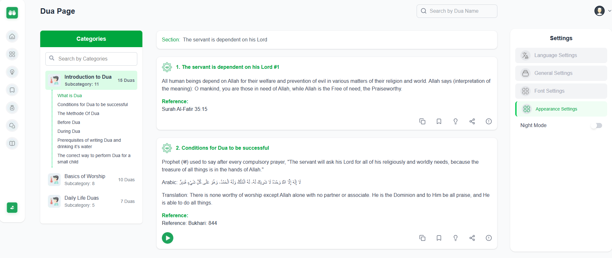
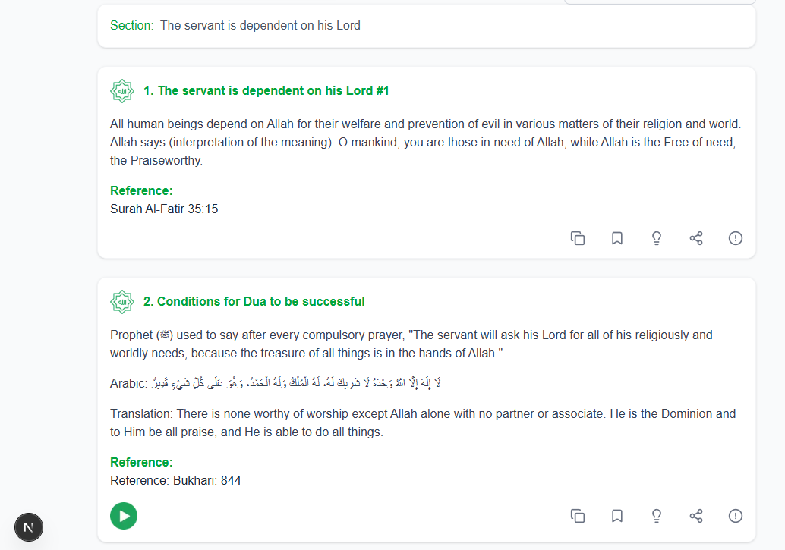
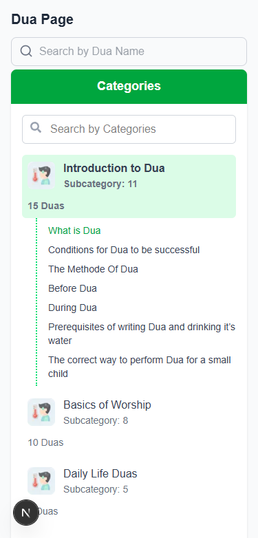

# IRD Foundation Assignment

A modern web application built with Next.js 15 and Tailwind CSS, featuring a clean and responsive design.

## Project Video Link : https://youtu.be/jcYfBVBZ3Tk

## Github Live Link : https://ird-assignment.vercel.app/

## Github Source Code Link : https://github.com/Mijan2001/ird-assignment

## Project photos





## Features

-   Modern Next.js App Router architecture
-   Responsive design with Tailwind CSS
-   Optimized performance with Turbopack
-   Clean and maintainable code structure
-   Comprehensive icon support with Lucide React and React Icons

## Technologies

-   **Framework:** [Next.js 15](https://nextjs.org/) (App Router)
-   **Styling:** [Tailwind CSS](https://tailwindcss.com/)
-   **Icons:** [Lucide React](https://lucide.dev/) & [React Icons](https://react-icons.github.io/react-icons/)
-   **Development:**
    -   ESLint for code linting
    -   Turbopack for faster development builds

## Prerequisites

Before you begin, ensure you have the following installed:

-   Node.js (Latest LTS version recommended)
-   npm or yarn package manager

## Installation

1. Clone the repository:

```bash
git clone https://github.com/Mijan2001/ird-assignment.git
cd ird-assignment
```

2. Install dependencies:

```bash
npm install
# or
yarn install
```

## Development

To start the development server:

```bash
npm run dev
# or
yarn dev
```

The application will be available at [http://localhost:3000](http://localhost:3000).

## Build

To create a production build:

```bash
npm run build
# or
yarn build
```

## Production

To start the production server:

```bash
npm run start
# or
yarn start
```

## Project Structure

```
ird-assignment/
├── app/                # Next.js app directory (App Router)
├── public/            # Static assets
├── .next/            # Next.js build output
├── node_modules/     # Dependencies
├── package.json      # Project configuration and dependencies
├── postcss.config.mjs # PostCSS configuration
├── next.config.mjs   # Next.js configuration
├── jsconfig.json     # JavaScript configuration
└── eslint.config.mjs # ESLint configuration
```

## Available Scripts

-   `dev` - Start development server with Turbopack
-   `build` - Create production build
-   `start` - Start production server
-   `lint` - Run ESLint
